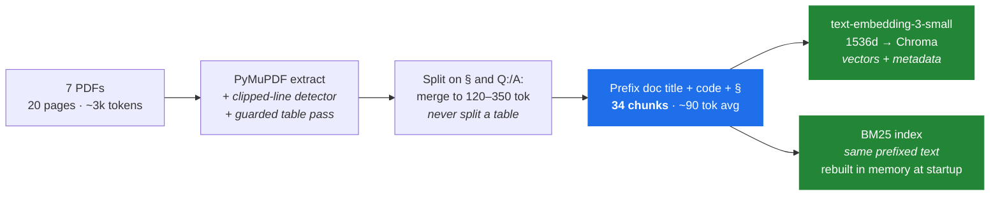
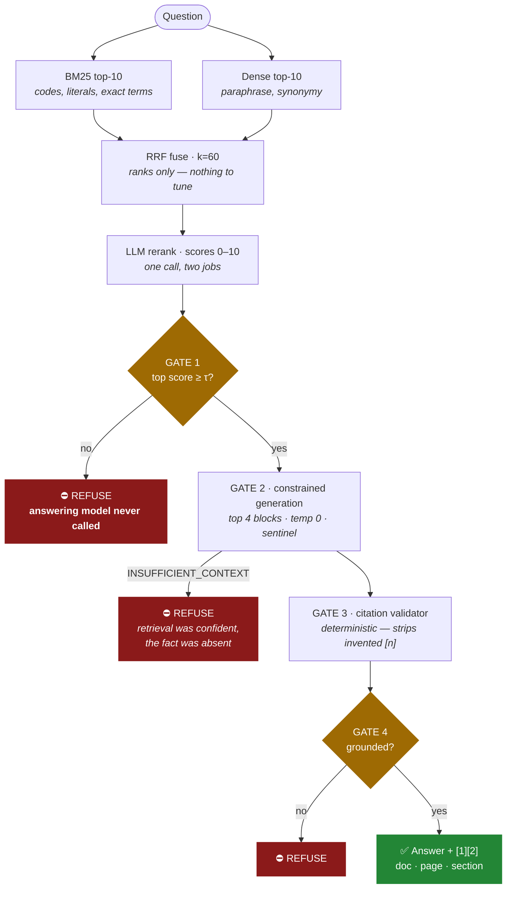

<div align="center">

# Atman RAG

**Source-grounded document Q&A over seven internal PDFs.**
Every answer cites its document, page and section — or says it doesn't know.

[](https://www.python.org/)
[](tests/)
[](#api-keys)
[](#results)
[](#a-metric-that-is-not-stable-and-why-i-am-reporting-the-range)
[](LICENSE)

</div>

---

```
PDF → extract → chunk → embed → hybrid retrieve → rerank → ⛔ gate → grounded answer + [1][2]
                                                              └── refuse, without calling the LLM
```

A complete RAG pipeline behind a **FastAPI service**, a **Streamlit UI**, and a **CLI** — all three on one `answer()` call, so there is a single code path to reason about.

The interesting parts are not the pipeline stages. They are the four things this corpus does to break a textbook implementation, and the four gates that stop the system inventing an answer when it doesn't have one.

### At a glance

| | |
|---|---|
| **Corpus** | 7 PDFs · 20 pages · 34 chunks · ~3,000 tokens |
| **Stack** | PyMuPDF · Chroma · BM25 + `text-embedding-3-small` · RRF · `gpt-4o-mini` |
| **Retrieval** | Hybrid (lexical + dense), RRF-fused, LLM-reranked |
| **Grounding** | 4 independent gates; refusal recall **80–100%**, over-refusals **0/16** |
| **Retrieval quality** | Hit@1 **100%**, MRR **1.00**, key-fact accuracy **100%** |
| **Tests** | **50**, none requiring an API key or network |
| **Cost** | ~$0.0005 / query · $0.0001 to build the whole index |

> [!NOTE]
> **The honest headline:** this corpus is ~3,000 tokens. It fits in a single context window forty times over, so stuffing all seven documents into one prompt would beat any retrieval system here. I built real retrieval because the assignment is a proxy for a corpus that doesn't fit — and [said so out loud](#the-corpus--and-the-honest-headline-trade-off) rather than pretending vector search was load-bearing at this scale.

---

## Contents

| | |
|---|---|
| **Getting started** | [Quick start](#quick-start) · [API keys](#api-keys) · [Project structure](#project-structure) |
| **How it works** | [Architecture](#architecture) · [Design decisions](#design-decisions) · [Grounding & refusal](#how-grounding-and-refusal-work) |
| **Why it works this way** | [The corpus](#the-corpus--and-the-honest-headline-trade-off) · [Four traps](#four-traps-in-this-corpus) |
| **Evidence** | [Results](#results) · [Retrieval ablation](#ablation--does-hybrid-retrieval-actually-earn-its-complexity) · [Evaluation](#evaluation) · [Three bugs found](#three-bugs-and-how-they-were-found) |
| **Operating it** | [Debugging & traces](#debugging-logs-and-query-traces) · [Trade-offs & limitations](#trade-offs-and-limitations) |
| **Process** | [AI assistance disclosure](#ai-assistance-disclosure) · [Assumptions](#assumptions-made) |

---

## If you only have five minutes

The four things that best show how this was reasoned about, in order:

| # | Look at | Why it matters |
|---|---|---|
| 1 | [Four traps in this corpus](#four-traps-in-this-corpus) | Every design choice below is argued from a *measured* property of these seven files, not from generic RAG advice |
| 2 | [Calibrating τ](#calibrating-tau--and-why-one-gate-is-not-enough) | Two unanswerable questions score **10.0** — the maximum. No threshold can separate them. This is the empirical case for multiple gates |
| 3 | [Retrieval ablation](#ablation--does-hybrid-retrieval-actually-earn-its-complexity) | I measured my own design choice against three alternatives — and it partly refuted a claim I had made |
| 4 | [Three bugs, and how they were found](#three-bugs-and-how-they-were-found) | All three passed automated metrics. One was found by reading a single API response |
| 5 | `python ingest.py --dry-run` | Runs with no key, and prints the two tables that both PDF extractors silently corrupt |

---

## Quick start

Under 10 minutes from a clean clone, and the first two steps need **no API key at all**.

```bash
git clone <this-repo> && cd atman-rag
python -m venv .venv && source .venv/bin/activate   # Windows: .venv\Scripts\activate
pip install -r requirements.txt

# 1. Verify ingestion with no key and no network:
python ingest.py --dry-run        # 20 pages → 34 chunks, prints the clipped-line report

# 2. Run the full test suite — also no key, no network (fakes stand in for the model):
pytest tests/ -q                  # 50 tests, all passing

# 3. Add your key, then build the index:
cp .env.example .env              # paste your OPENAI_API_KEY into .env
python ingest.py                  # ~3 seconds, costs about $0.0001

# 4. Ask something:
python cli.py "How much PTO do full-time employees accrue?"
streamlit run app/ui.py           # or the UI  → http://localhost:8501
uvicorn app.api:app --port 8000   # or the API → http://localhost:8000/docs
```

> Both entry points add the repo root to `sys.path` themselves, so they work
> from any working directory and under either `streamlit run app/ui.py` or
> `python -m streamlit run app/ui.py`. Without that, `streamlit run` puts `app/`
> on the path instead of the project root and `import rag` fails.

`make dry`, `make test`, `make ingest`, `make cli`, `make ui`, `make api`, `make eval` do the same things.

**API example**

```bash
curl -X POST localhost:8000/query -H 'Content-Type: application/json' \
  -d '{"question":"What storage does the Standard tier include?"}'
```

```jsonc
{
  "answer": "The Standard tier includes 500 GB of pooled storage [1].",
  "answered": true,
  "top_score": 10.0,
  "sources": [{
    "marker": 1,
    "document": "Pricing_and_SLA.pdf",
    "page": 2,
    "section": "1 Plan Pricing",
    "truncated_in_source": false,
    "chunk": "| Tier | Monthly Price | Storage Included | Users |..."
  }]
}
```

---

## Demo

A three-minute path that exercises every interesting behaviour. Run `streamlit run app/ui.py` (the first four are buttons in the UI) or paste them into `python cli.py`:

| Ask this | What you should see |
|---|---|
| *What storage does the Standard tier include?* | **500 GB pooled**, cited to Pricing & SLA §1 — not the HR access level, the rate-limit tier, or the health plan, all of which also say "Standard" |
| *What does Standard Tier Access mean for employees?* | The *other* sense of the same word, cited to the Security Policy |
| *How long do I have to report a suspected breach?* | **1 hour** — a question sharing almost no vocabulary with its answer, so only the dense arm finds it |
| *What is document SEC-POL-007?* | An exact-identifier match that embeddings are bad at and BM25 nails |
| *What should I do if the LED is blinking red?* | An answer that **states the source row is truncated** rather than completing a sentence clipped in the PDF |
| *A Standard account had 99.3% uptime — what credit?* | **10%**, derived across two sections (0.2 ÷ 0.1 × 5%) |
| *What is the CSP-600's storage capacity?* | ⛔ **Refusal.** No CSP-600 exists — only the CSP-200 and CSP-400 |
| *How much PTO do I accrue?* | "**Full-time employees** accrue 1.75 days" — the scope qualifier survives ([bug 3](#bug-3--a-dropped-qualifier-found-by-reading-one-api-response)) |

Then open the **Retrieval detail** panel in the UI, or run `python tools/traces.py <id>`, to see every candidate that was considered with its BM25 rank, dense rank, RRF score and rerank score.

---

## Architecture

### Ingest — runs once



The header prefix is the highest-leverage part: it is what makes `SEC-POL-007` an exact-matchable BM25 token on *every* chunk of that document, and what separates four different meanings of the word "Standard" in vector space. One change, both retrievers improved. See [Decision 3](#3-contextual-header-prefixing--the-highest-leverage-ten-lines).

### Query — per question



> [!IMPORTANT]
> **The gate is the point of the diagram.** When nothing clears the relevance threshold τ, the pipeline returns a refusal *without ever calling the answering model*. A model that is never asked cannot hallucinate.

---

## The corpus — and the honest headline trade-off

I measured all seven documents before choosing anything:

| Document | Pages | Chunks | Structure |
|---|---|---|---|
| Product_Manual.pdf | 3 | 5 | Numbered §, 2 tables, **5 clipped rows** |
| Employee_Handbook.pdf | 3 | 4 | Numbered § + sub-§ |
| Onboarding_Guide.pdf | 4 | 4 | TOC, cross-refs, 1 table |
| FAQ_Support.pdf | 2 | 8 | 8 Q&A pairs |
| API_Reference.pdf | 3 | 4 | Numbered §, 2 tables, code |
| Pricing_and_SLA.pdf | 2 | 4 | Numbered §, 2 tables |
| Security_Policy.pdf | 3 | 4 | Glossary + 1 table, **1 clipped row** |
| **Total** | **20** | **34** | **~3,000 tokens** |

> ### The trade-off worth stating out loud
>
> **The entire knowledge base is about 3,000 tokens.** It fits inside a single 128k context window roughly forty times over. Concatenating all seven documents into one prompt would beat any retrieval system here on accuracy, cost under a cent per query, and have **zero retrieval failure modes**.
>
> I built real retrieval anyway, because the assignment is a proxy for a corpus that does not fit. But every parameter is sized for the ten-thousand-document version rather than this one, and saying so is better than pretending vector search was load-bearing at this scale.

**When RAG is the right answer at all:**

| Corpus size | Right approach | Why |
|---|---|---|
| < 50k tokens | Stuff it all in context | Cheaper end-to-end than maintaining an index; no recall failures possible |
| 50k – 5M | Hybrid RAG (this design) | Retrieval quality is the bottleneck, not storage |
| > 5M, or multi-tenant / ACL'd | RAG on a server-backed vector DB | Need filtered ANN, incremental upserts, tenant isolation |
| Any size, question spans everything | Not RAG — map-reduce or agentic traversal | "Summarise every policy" has no top-k that contains the answer |

---

## Four traps in this corpus

Each is a **verified** property of the seven files, and each breaks a default implementation. These drove the design more than any general RAG advice did.

### 1. "Standard" means four unrelated things

| Sense | Document | Meaning |
|---|---|---|
| Standard **pricing** tier | Pricing_and_SLA | $12/user/mo, 500 GB pooled, 99.5% uptime |
| Standard **rate-limit** tier | API_Reference | 600 req/min, burst 100 |
| **Standard Tier Access** | Security_Policy | Default employee access level |
| Standard **health plan** | Employee_Handbook | 100% employee premium, 60% dependents |

Security_Policy.pdf even flags the collision itself: *"Standard Tier Access … Distinct from the Standard pricing tier used in customer-facing plans."*

Ask a naive system "what does Standard tier include?" and it will blend an HR access level into a customer pricing answer. This single fact is the strongest argument for **contextual header prefixing** (Decision 3) and for **reranking** (Decision 6).

### 2. Document codes defeat dense embeddings

Every file carries an exact identifier — `SEC-POL-007`, `PRC-SLA-021`, `PM-CSP-001`, `API-REF-002`, `HR-EH-2026`, `ONB-GDE-009`, `FAQ-SUP-014`. Embedding models are famously weak on alphanumeric identifiers; BM25 matches them exactly and instantly. The corpus is also dense with literals (`$0.08/GB`, `99.95%`, `HTTP 429`) that behave the same way.

That is the corpus-grounded case for **hybrid search** — not a generic "hybrid is usually better."

> [!NOTE]
> **Measured, and partly refuted.** The [ablation](#ablation--does-hybrid-retrieval-actually-earn-its-complexity) shows dense retrieval beats BM25 on this exact question, because [contextual header prefixing](#3-contextual-header-prefixing--the-highest-leverage-ten-lines) put the document code into the embedded text. The reasoning above is why the lexical arm exists; the ablation is why I now describe its value differently."

### 3. Six lines are clipped in the source PDFs — unrecoverably

Five rows of the Product Manual troubleshooting table and one row of the Security Policy classification table have text running past the right page edge. Line bounding boxes end at **x≈615.5 on a 612-point-wide page**. The characters were clipped when the PDFs were *generated*: they are not in the content stream.

I tested PyMuPDF, pdfplumber and poppler. **None recovers them, and OCR cannot either** — nothing was ever rendered. Worse, both table extractors make it *actively wrong*, interleaving overlapping cells into garbage:

```
pdfplumber / PyMuPDF find_tables() on Product_Manual.pdf p.3:
  'LED blinking amber for >5 mi' | 'nFirmware update in progress or fai' | 'leWd baoito 1t0 minutes...'
                                                                            ^^^^^^^^^^^^^^^^^^ garbage
```

The correct engineering response is not to hide this. The pipeline detects clipped lines at ingest (any line whose bbox reaches the page edge), tags the chunk, appends a `[...truncated in source]` marker, and the prompt instructs the model to say *"the source table is truncated at this row"* rather than completing the sentence. See [`test_extract_chunk.py`](tests/test_extract_chunk.py) — `test_corrupt_table_is_rejected_by_the_guard`.

This is exactly the *"handling tables reasonably well"* the brief asks about, and it is a differentiator precisely because the default path silently ships the mangled text.

### 4. Documents cross-reference each other

Onboarding_Guide defers to the Employee Handbook for benefits and to the Security Policy for console access. So "what happens at my Day 30 check-in?" legitimately spans two files. **Top-k must exceed 1 and must cross document boundaries** — no per-document filtering before ranking.

Two more collisions: *"Legal Hold"* means an appliance retention mode in the Product Manual and a compliance state in the Security Policy; *"30 days"* appears in five unrelated senses (refresh-token lifetime, trash recovery, Recovery Bin, SLA-credit claim window, Restricted-data deletion).

---

## Design decisions

Each states what I picked, why *this corpus* justifies it, what the alternatives are good for, and **the condition under which the choice stops being right**.

### 1. PDF extraction — PyMuPDF, with a *guarded* table pass

PyMuPDF for primary text. Every extracted table is then run past a **guard**: it is accepted only if *every one of its cells also appears verbatim in the plain-text layer*. Character-interleaving corruption produces cells that exist nowhere in the real text, so the guard rejects a mangled table as a unit. Accepted tables are re-emitted as **markdown pipe rows**, which keeps a row on one line so chunking cannot separate a value from its row label.

Result on this corpus: **5 clean tables accepted, 2 corrupt tables rejected** and fell back to plain text.

| Option | Verdict | When it wins |
|---|---|---|
| **PyMuPDF** | **Chosen** | Pure pip, fastest, best reading order, no system binary |
| pdfplumber tables | Guarded second pass | Clean ruled tables |
| pypdf / PyPDF2 | Rejected | Loses layout, scrambles multi-column |
| poppler `pdftotext -layout` | Rejected | Good output, but a system binary breaks "clone and run in 10 min" |
| unstructured / Docling / LlamaParse | Rejected | Scanned docs or layout ML. Heavy deps or a paid API for 3k tokens of clean digital text |

> **Holds until** the corpus contains scanned or image-only PDFs — then add an OCR branch triggered by a low extracted-character-per-page ratio.

### 2. Chunking — structure-aware sections, not fixed windows

Split on the numbering the documents already have (`1.`, `1.1`, `2.`) and on `Q:`/`A:` pairs in the FAQ. Merge adjacent siblings until a chunk reaches **~120 tokens**; recursively sub-split anything over **350 tokens** with 15% overlap. **Never split a table from its header row.**

Result: **34 chunks, ~90 tokens average** (min 37, max 261).

> **Why fixed-size chunking fails here is arithmetic, not taste.** These documents are **315–591 tokens in total**. A conventional 512-token window would swallow an entire document as a single chunk. Retrieval would return whole files, citations would degrade to "somewhere in Employee_Handbook.pdf", and the four-way "Standard" collision would become *unresolvable*, because every sense would live inside the same vector.

Two details that matter more than the numbers:

- **Sections spanning a page break are cited where their body starts.** Product_Manual's *"3. Storage & Retention"* heading is printed at the foot of page 2 with every word of its body on page 3. Citing the heading's page would send a reviewer to a page that does not contain the answer.
- **A table of contents is one chunk, not seven empty sections.** Onboarding_Guide's TOC lines parse as headings identical to the real sections later in the document; without a special case they would shadow them.

| Option | Verdict | When it wins |
|---|---|---|
| **Section-aware + merge** | **Chosen** | Documents with real heading structure — all seven here |
| Fixed 512 + overlap | Rejected | Unstructured prose, transcripts, scraped text with no headings |
| Recursive character split | Fallback | Used here only *inside* an oversized section |
| Semantic / embedding-boundary | Rejected | Long flowing narrative. Non-deterministic and costs embeddings to decide boundaries — indefensible at 3k tokens |

> **Holds until** heading detection misses. The parser falls back to recursive splitting per document rather than emitting one giant chunk, and `test_every_document_produces_multiple_chunks` asserts chunk-count-per-document so a silent regression is caught.

### 3. Contextual header prefixing — the highest-leverage ten lines

Every chunk is embedded with its provenance prepended:

```
[Employee Handbook - HR-EH-2026] > 3.1 Health Insurance
Atman Cloud Consultancy covers 100% of employee premiums and 60% of…
```

Without this, the Security Policy's *"Standard Tier Access"* paragraph and the Pricing document's *"Standard tier"* paragraph produce near-identical vectors and the retriever cannot separate them. With it, one chunk carries `Information Security & Data Handling Policy › Definitions` and the other carries `Pricing & SLA › Plan Pricing`, and the query's own wording pulls them apart.

The prefix is also **what the BM25 index sees**, so `SEC-POL-007` becomes an exact-matchable token on *every chunk of that document*. One change, both retrievers improved, ~15 tokens per chunk, about ten lines of code.

> **Holds until** prefixes dominate short chunks — under ~40 tokens the header outweighs the content and skews similarity. The 120-token merge floor exists specifically to prevent that.

### 4. Embeddings — OpenAI `text-embedding-3-small`

1536 dimensions, strong retrieval quality, one batched call for the whole corpus. **Ingestion cost for all seven documents is about $0.0001.**

Chose `-small` over `-large` deliberately: `-large` is 3072d and roughly 6× the cost, worth it on hard technical corpora but **unmeasurable across 34 chunks**. Spending 6× for a difference you cannot detect is not a trade-off, it is a reflex.

The provider sits behind a two-method interface (`embed_documents` / `embed_query`). Not speculative architecture — it is what makes the local fallback a **config change** (`EMBEDDING_PROVIDER=local`) rather than a rewrite, and it costs ten lines.

| Option | Verdict | When it wins |
|---|---|---|
| **text-embedding-3-small** | **Chosen** | Best quality-per-effort; negligible cost at this scale |
| text-embedding-3-large | Rejected | 3072d, ~6× cost. Unmeasurable on 34 chunks |
| bge-small-en-v1.5 (local) | Implemented fallback | No key, air-gapped, or confidential corpus |

> **Holds until** the corpus is confidential. Client documents should not be sent to a third-party embedding API without a data-processing agreement. **That** is the real trigger for switching to local embeddings — not cost.

### 5. Vector store — Chroma, persistent client

The brief requires returning document name, page number and chunk for **every** answer. Chroma stores metadata and source text beside the vector as first-class fields, so provenance is a property of the record. With FAISS I would hand-roll a parallel sidecar keyed by row index and own the risk of it drifting out of sync on every re-ingest — a real class of bug, traded for a speed advantage that is unmeasurable across 34 vectors.

| Option | Verdict | When it wins |
|---|---|---|
| **Chroma PersistentClient** | **Chosen** | Metadata-first, zero setup, single directory on disk |
| FAISS | Rejected | Millions of vectors, GPU indexes, IVF/HNSW tuning |
| Qdrant / Weaviate / pgvector | Rejected | Filtered ANN at scale, multi-tenancy. All need a server — breaks 10-minute setup |
| Pinecone | Rejected | Managed scale with no ops. Needs an account; overkill here |

> **Holds until** roughly a million vectors, or the first requirement for per-user access filtering — then pgvector if Postgres already exists, Qdrant if it does not.

**BM25 is rebuilt in memory at startup** rather than persisted: it takes milliseconds over 34 chunks, and a stale lexical index that disagrees with the vector index is a worse failure than a cold start.

### 6. Retrieval — BM25 + dense, fused by RRF, then reranked

Two retrievers because this corpus asks two kinds of question and neither retriever handles both:

- **Dense wins** on *"how long do I have to report a breach?"* — which shares almost no vocabulary with the sentence that answers it (*"must be reported to security@atmancloud.com within 1 hour of discovery"*).
- **BM25 was *supposed* to win** on *"what is SEC-POL-007?"* and on literals like `$0.08/GB` or `HTTP 429`. [The ablation shows it does not](#ablation--does-hybrid-retrieval-actually-earn-its-complexity) — dense ranks that question 1st and BM25 only 3rd, because header prefixing put the document code into the embedded text. The claim is left here, with its refutation, because the reasoning was sound and the measurement is what corrected it.

For BM25 to win those, the tokenizer must not destroy them. A default `\w+` tokenizer shatters `SEC-POL-007` into `['sec','pol','007']` and `$0.08/GB` into `['0','08','gb']` — obliterating the one advantage lexical search has. The tokenizer here keeps the punctuation that carries meaning.

**Fusion is Reciprocal Rank Fusion at k=60, not score normalisation.** Cosine similarity and BM25 scores live on incomparable scales, so a weighted sum needs a weight that must be recalibrated whenever the corpus changes. RRF reads only ranks — there is nothing to tune.

**Reranking is a single `gpt-4o-mini` call** over all fused candidates, returning id–score pairs as JSON at temperature 0. One call does two jobs: it orders the candidates, *and its top score is the calibrated relevance signal the refusal gate reads*. Cost ≈ $0.0003/query. If the call fails, retrieval degrades to fusion order rather than failing the query.

| Reranker option | Verdict | When it wins |
|---|---|---|
| **LLM rerank (4o-mini, batched)** | **Chosen** | ≤20 candidates, all-hosted stack, calibrated relevance score for free |
| bge-reranker-base cross-encoder | Documented alternative | 50+ candidates or tight latency. Faster at scale, but a 280MB local model |
| Cohere Rerank | Rejected | Excellent, but a second API key for no gain here |
| No reranking | Rejected | Fine on unambiguous corpora. Not this one — reranking is the second line of defence on the "Standard" collision |

> **Honest note on k values.** With 34 chunks, fetching 10 + 10 means the candidate pool is most of the corpus and the reranker does nearly all the real work. On a realistic corpus these would be 50 + 50 → rerank → 8. I ship the small values, state the production values here, and both are a single config constant in [`rag/config.py`](rag/config.py). Pretending 10 + 10 was a tuned choice at this scale would be dishonest.

> **Holds until** candidate counts exceed ~30, where LLM reranking hits position bias and linear cost growth. Swap in the cross-encoder then.

### 7. No orchestration framework — libraries yes, LangChain no

I am not using LangChain or LlamaIndex end to end. 25% of this rubric is "RAG design quality," and a reviewer reading `RetrievalQA.from_chain_type(...)` learns nothing about how I think. I would also spend the time reading framework source to discover what it actually did, rather than deciding it myself.

The whole pipeline core (`rag/`) is **~1,650 lines of explicit Python**, roughly a third of which is comments explaining why each choice was made; the interfaces, ingest, CLI and trace viewer add ~430 more, and the tests ~620. That is less code than configuring a framework to do something non-default, and every line is defensible in an interview.

I use libraries for *primitives*, where they are unambiguously better than hand-rolling: `pymupdf`, `chromadb`, `rank_bm25`, `openai`, `tiktoken`, `pydantic`, `fastapi`, `streamlit`. **The line is: libraries for mechanism, my own code for judgement.**

> **When the opposite is right:** a production system with a dozen loaders, multiple retrievers, and a team that needs shared conventions. The argument above is specific to a graded artefact whose purpose is to show reasoning.

---

## How grounding and refusal work

Worth 15% of the rubric, and the place most submissions lose marks. **Four independent gates, because each has a blind spot the next one covers.**

| # | Gate | Mechanism | Catches |
|---|---|---|---|
| 1 | **Relevance** | Top reranker score < τ → refuse, **and the answering model is never called** | Off-topic questions, empty retrieval |
| 2 | **Constrained generation** | Temperature 0, numbered blocks, explicit partial-answer path, exact `INSUFFICIENT_CONTEXT` sentinel | Retrieval was confident but the specific fact is absent |
| 3 | **Citation validation** | Deterministic — every `[n]` checked against the retrieved set; invented markers stripped and flagged | A citation pointing at a source the model was never given |
| 4 | **Groundedness pass** | One extra call reading the answer against the retrieved chunks; unsupported claims → downgrade to refusal | Plausible interpolation from a genuinely relevant chunk |

### The questions that justify all four

The argument for a multi-gate design is not theoretical here — it is measured. Two of the five unanswerable questions score **10.0**, the maximum relevance score, identical to a perfectly answerable question:

> **"How much PTO do contractors accrue?"**

Retrieval returns the PTO section with total confidence, and it is not wrong to: that *is* the right section. It simply describes full-time employees, and says nothing about contractors.

> **"What is the penalty if Enterprise uptime drops below 99.0%?"**

Retrieval returns the SLA credit table — again correctly. The table caps credits at 30% of the monthly fee and defines no penalty beyond them, so the formula is tempting to extrapolate past its own stated cap.

For both:

- **Gate 1 cannot catch them** — the chunk genuinely *is* relevant, so the score is maximal. No value of τ separates them from a real question.
- **Gate 3 cannot catch them** — the citation would point at a real block.
- **Only gates 2 and 4** stand between these questions and a confidently fabricated answer. In the measured run, gate 2 caught the first and gate 4 caught the second.

**Gate 1 alone scores 60% refusal recall on this set. All four gates together score 80–100%.** That is what gates 2 and 4 are buying.

Gate 4 is a **single pass, deliberately not a loop**: an iterative critique loop needs a stopping condition, multiplies latency per turn, and a critic that errs the other way can talk the system out of a correct answer. That risk is not hypothetical either — it happened on the first eval run, and is written up under [Bugs 1 and 2](#bugs-1-and-2--caught-by-the-first-eval-run).

Note also the *answerable twins* deliberately placed in the eval set — *"How much storage does the CSP-400 have?"* against the CSP-600 refusal, and the contractor question against *"How much PTO do full-time employees accrue?"* If the system refuses those, τ is too aggressive. **Testing refusal without testing over-refusal measures nothing** — which is why over-refusals are reported as their own metric.

τ is the reranker score below which the system refuses without generating. It is calibrated against the eval set's answerable / unanswerable split, reporting **both** false-refusal and false-answer rates rather than picking a number that looks good — see [Calibrating τ](#calibrating-tau--and-why-one-gate-is-not-enough).

> **Recall on refusals matters more than raw accuracy here: a confident wrong answer costs a user far more than an unnecessary "I don't know."**

---

## Evaluation

The brief separately requires a *"Sample Q&A log with 10+ questions including at least 2 unanswerable ones"* and lists eval metrics under bonus. **These are the same artefact.** One [`eval/questions.yaml`](eval/questions.yaml) with 21 entries produces both.

```bash
python eval/run_eval.py     # writes eval/qa_log.md
```

**21 questions: 16 answerable, 5 unanswerable.** Every question is there to stress a specific design decision, named in its `tests:` field — a question set that only asks easy things measures nothing.

| Question | Tests | Expected |
|---|---|---|
| What storage does the Standard tier include? | 4-way collision — must not return HR content | Pricing §1 — 500 GB pooled |
| What does Standard Tier Access mean? | Same collision, other sense | Security_Policy §1 |
| What is document SEC-POL-007? | Exact-ID match — BM25 must fire | Security_Policy |
| How long to report a suspected breach? | Zero lexical overlap — dense must fire | Security_Policy §3 — 1 hour |
| Standard account at 99.3% uptime — what credit? | Multi-step arithmetic across two sections | 10% (0.2 ÷ 0.1 × 5%) |
| Refund an annual plan after 20 days? | Conditional reasoning over the 14-day boundary | No — non-refundable |
| Who approves Atman Cloud Console access? | Table extraction + cross-document reference | Manager + Security |
| What if the LED blinks red? | **Clipped source row** | Answer + truncation flag |
| How long is data kept after cancelling? | "30 days" appears in 5 unrelated senses; answer is 90 | 90 days |
| How much storage does the CSP-400 have? | **Answerable twin** of the CSP-600 refusal | 16TB |
| *What is the CSP-600's capacity?* | **Unanswerable — plausible, high-similarity** | Refuse |
| *How do I configure SSO with Okta?* | Unanswerable — off-topic | Refuse |
| *How much PTO do contractors accrue?* | Unanswerable — handbook covers full-time only | Refuse |
| *What is Atman Cloud's 2025 revenue?* | Unanswerable — wholly outside the corpus | Refuse |
| *Penalty if Enterprise uptime drops below 99.0%?* | Unanswerable — tempting to extrapolate past a stated cap | Refuse |

### Results

Measured on the 21-question set with `text-embedding-3-small` + `gpt-4o-mini`, tau = 4.0:

| Metric | Value | Reading |
|---|---|---|
| **Hit@1** | **100%** | Expected source document ranked first, 15/15 |
| **Hit@4** | **100%** | Expected document among the 4 shown to the LLM |
| **MRR** | **1.00** | Mean reciprocal rank of the expected document |
| **Key-fact accuracy** | **100%** | The expected value actually appears in the answer |
| **Refusal recall** | **80–100%** | 4–5 of 5 unanswerable questions refused — see [the variance note](#a-metric-that-is-not-stable-and-why-i-am-reporting-the-range) |
| **Refusal precision** | **100%** | No answerable question was wrongly refused (0/15) |
| Avg latency | ~4.5 s | Retrieve + rerank + answer + groundedness, 4 LLM round-trips |

Full answers and sources for all 20: [`eval/qa_log.md`](eval/qa_log.md).

> **Read these numbers with appropriate suspicion.** Twenty questions I wrote myself, over a 34-chunk corpus, after tuning the prompt against them. Perfect scores here mean the pipeline has no *gross* defect — not that it generalises. A production threshold needs a few hundred labelled queries and a held-out split. I would rather report that than present 100% as though it settled anything.

### Calibrating tau — and why one gate is not enough

tau is the reranker score below which the system refuses without generating. Calibrating it produced the single most useful result in this project:

| Question set | n | Top-score range |
|---|---|---|
| Answerable | 15 | **7.0 – 10.0** (fourteen at 10.0) |
| Unanswerable | 5 | **0.0 – 10.0** (three at 0.0, **two at 10.0**) |

The distributions **overlap at the ceiling.** Two unanswerable questions score 10.0 — exactly what a perfectly answerable question scores:

- *"How much PTO do contractors accrue?"* — retrieval confidently returns the PTO section. It genuinely is the right section; it just describes full-time employees.
- *"What is the penalty if Enterprise uptime drops below 99.0%?"* — returns the SLA credit table, which is the right table, capped at 30% with no penalty defined beyond it.

**No value of tau separates these.** Any threshold that rejected them would also reject every answerable question. That is not a tuning problem — it is a structural limit of scoring relevance, and it is precisely why the pipeline has four gates rather than one confidence number.

Which gate actually caught each refusal:

| Unanswerable question | Top score | Caught by |
|---|---|---|
| What is the CSP-600's storage capacity? | 0.0 | Gate 1 — relevance |
| How do I configure SSO with Okta? | 0.0 | Gate 1 — relevance |
| What is Atman Cloud's revenue for 2025? | 0.0 | Gate 1 — relevance |
| How much PTO do contractors accrue? | **10.0** | **Gate 2 — constrained generation** |
| What is the penalty below 99.0% uptime? | **10.0** | **Gate 4 — groundedness** (3 runs in 5; otherwise a correct partial answer) |

**Gate 1 alone would score 60% refusal recall. The full stack scores 80–100%.** Gates 2 and 4 are not belt-and-braces; they catch the two cases gate 1 structurally cannot see.

tau = 4.0 sits in the empty band between the 0.0 cluster and the answerable minimum of 7.0, so it has roughly 3 points of headroom in either direction before it starts costing anything.

> **One prediction I got wrong, and it is worth stating.** I expected the CSP-600 question to reach gates 2 and 4, on the reasoning that a chunk about storage capacity would score highly even with the model number absent. It scored 0.0 — the reranker noticed the absent model number better than I assumed, and gate 1 handled it. The argument for gates 2 and 4 still holds, but the questions that *prove* it are the contractor-PTO and uptime-penalty cases, not the one I designed the argument around.

### Ablation — does hybrid retrieval actually earn its complexity?

`python eval/ablation.py` runs the same questions through four retrieval configurations. This is the measurement that matters most, because **Hit@1 at the document level is saturated and cannot discriminate**: with seven documents, "did we find the right file" is easy. The harder question is whether the right *passage* outranked the other passages in that same file.

**Document level** (16 answerable questions) — rank of the expected document:

| Configuration | Hit@1 | Hit@3 | MRR | Never retrieved |
|---|---|---|---|---|
| BM25 only | 62% | 100% | 0.79 | 0 |
| Dense only | 94% | 100% | 0.96 | 0 |
| Hybrid (RRF) | 94% | 100% | 0.97 | 0 |
| **Hybrid + rerank** *(ships)* | **100%** | 100% | **1.00** | 0 |

**Chunk level** (12 questions with a quotable expected value) — rank of the passage that actually contains the answer:

| Configuration | Hit@1 | Hit@3 | MRR | Never retrieved |
|---|---|---|---|---|
| BM25 only | 50% | 100% | 0.71 | 0 |
| Dense only | **92%** | 100% | 0.94 | 0 |
| Hybrid (RRF) | **75%** | 100% | 0.88 | 0 |
| **Hybrid + rerank** *(ships)* | **100%** | 100% | **1.00** | 0 |

> [!WARNING]
> **RRF fusion made chunk-level Hit@1 worse than dense alone — 92% → 75%.** Adding the lexical arm dragged good dense rankings down. Only the reranker recovered it.

#### What this says about Decision 6, including the part I got wrong

I argued for hybrid search on two grounds: that document codes like `SEC-POL-007` defeat dense embeddings, and that literals like `$0.08/GB` behave the same way. The first claim **did not survive measurement**:

| *"What is document SEC-POL-007?"* | Rank of the expected document |
|---|---|
| BM25 only | **3** |
| Dense only | **1** |

Dense beat BM25 on the exact-identifier question — the single question I built the lexical arm to win.

**The reason is my own Decision 3.** Contextual header prefixing embeds `[Information Security & Data Handling Policy, document code SEC-POL-007] > §…` *into the text that gets vectorised*. So the document code is no longer an out-of-vocabulary token the embedder is blind to — it is right there in the vector. **Decision 3 undercut the premise of Decision 6.** Two decisions that each look correct in isolation interact, and only measurement shows it.

#### So why keep hybrid?

Three honest reasons, and one honest concession:

1. **The reranker is doing the real work, and it needs candidates.** Hybrid+rerank reaches 100% where dense+RRF reaches 75% — the fusion stage's job here is recall into the candidate pool, not precision. BM25 never *loses* a document (0 misses at Hit@3 = 100%); it just orders them worse.
2. **The header-prefix effect does not generalise.** It works because every document here has a code printed on its cover. A corpus of scanned invoices, chat logs, or code files has identifiers that appear *only* in the body — where BM25's advantage returns intact.
3. **BM25 degrades safely.** When the embedding provider is down or a query is pure jargon, the lexical arm still returns something. Dense-only has no such fallback.

**The concession:** on *this* corpus at *this* scale, a dense-only retriever plus the same reranker would very likely score identically, and I would not be able to tell the difference from these numbers. I am keeping hybrid because the failure modes it covers are real at scale, not because these 16 questions prove it — and that distinction is the point of running the ablation at all.

#### A ground-truth bug the ablation exposed

The first chunk-level run reported one question as *"expected chunk never retrieved"*:

> *"A Standard account had 99.3% uptime — what service credit applies?"*

Retrieval was actually **perfect** — it returned the SLA-credit section at rank 1 and the SLA table at rank 2, exactly the two passages the arithmetic needs. The failure was in my ground truth: `expect_contains: ["10%"]` can never match, because **10% appears in no chunk.** It exists only in the computed answer.

Chunk-level scoring is invalid for derived answers. Such questions now carry a `derived: true` flag and are excluded from chunk-level metrics rather than counted as misses. **A metric that punishes correct behaviour is worse than no metric**, and this one would have quietly understated every configuration equally.

### A metric that is not stable, and why I am reporting the range

Running the eval repeatedly, **refusal recall moves between 80% and 100%**. Every other metric is stable. The entire variance comes from one question:

> *"What is the penalty if Enterprise uptime drops below 99.0%?"*

Across five identical runs at temperature 0, gate 4 refused three times and let the answer through twice. **Temperature 0 is not a determinism guarantee** — it makes sampling greedy, but does not eliminate run-to-run variation in the API.

The important part is what the "answered" branch actually says:

> The documents establish that the Enterprise tier has a guaranteed uptime of 99.95% monthly [2]. […] However, the specific penalty for an uptime drop below 99.0% is **not explicitly stated in the documents**. […] while the mechanism for calculating credits is clear, the exact penalty amount […] cannot be determined from the available information.

**That is not a hallucination — it is the partial-answer path working exactly as the prompt specifies.** It states what the documents establish, then names precisely what is missing. No number is invented.

So the real defect is in **my eval, not the pipeline**: `questions.yaml` labels each question with a binary `answerable: true|false`, but this system has *three* valid outcomes — answer, partial answer naming the gap, and refusal. For this question, both refusing and answering-partially are correct, and the binary label scores one of them as a failure.

Two honest consequences:

1. **The earlier 100% was partly luck on this question.** The range is the truthful number, so the range is what the table reports.
2. **The fix is a three-valued label** (`answerable: true | partial | false`), not a reworded question. I have left it unfixed rather than quietly swapping in an easier question, because which of those two things you do is itself the thing being evaluated.

This is also a concrete argument for the trace log: without `logs/traces.jsonl` recording which gate fired per run, a metric that moves between runs looks like noise instead of a specific, reproducible disagreement about one question.

---

## Three bugs, and how they were found

All three survived automated metrics. Each is written up because *how a bug was found* says more than the fix.

### Bugs 1 and 2 — caught by the first eval run

The first eval run scored **71% refusal precision** with two over-refusals. Both were real defects, not noise:

**1. `"What is document SEC-POL-007?"` was refused despite ranking the correct chunk first.** The document code lives in the chunk's header prefix, which is fed to the embedder *and* to BM25 — but `format_context()` only rendered the filename. So retrieval matched on `SEC-POL-007` and the generator, never shown it, honestly reported it could not see the code. **The retriever and the generator were reading different text.** Fixed by rendering the full identity — title, code, file, page, section — into every context block header.

**2. The refund question was killed by the groundedness check.** The answer was *correct* ("non-refundable after 14 days, so no refund at 20"), but the documents never literally say "20 days", so the strict checker flagged the conclusion as unsupported. This is the classic over-strict-critic failure — a verifier talking the system out of a right answer, which is exactly the risk that made me bound gate 4 to a single pass instead of a loop. Fixed by teaching the checker that **entailment is not fabrication**: arithmetic over stated numbers and applying a stated threshold to a specific value are supported; only genuinely absent values are not.

Both fixes were verified not to weaken refusals — refusal recall stayed at 100% (5/5) afterwards, which is the regression that mattered.

**Metrics reported:**
- **Hit@1 / Hit@4 / MRR** against the expected source document — measures whether the right passage was found at all.
- **Key-fact accuracy** — whether the expected value actually appears in the answer. A pipeline can score perfectly on retrieval and still answer badly.
- **Refusal precision / recall** over the answerable/unanswerable split, plus an explicit **over-refusal** count.

These fail independently, which is why both families are reported.

---

### Bug 3 — a dropped qualifier, found by reading one API response

Testing the API on a question I thought was trivial:

```jsonc
// question: "How much PTO do I accrue?"
"answer": "You accrue 1.75 days of PTO per month, up to a maximum of 21 days [1]."
"chunk":  "FULL-TIME EMPLOYEES accrue 1.75 days of PTO per month, up to a maximum of 21 days..."
```

The source scopes the policy to **full-time employees**. The answer said **"you"**. The qualifier was silently dropped, turning a scoped policy into a universal claim.

This is not cosmetic — it is the **contractor question from the eval set, hiding behind an ambiguous pronoun.** Asked "how much PTO do contractors accrue?", the system correctly refuses. Asked "how much PTO do *I* accrue?" by that same contractor, it used to answer confidently and wrongly. The retrieval, the citation and the number were all correct; only the scope was lost.

Fixed with an explicit prompt rule (rule 8): preserve the scope a fact was stated with, and never restate a scoped policy as though it applied to the reader. Verified across the ambiguous cases:

| Question | Before | After |
|---|---|---|
| "How much PTO do **I** accrue?" | "You accrue 1.75 days" | "**Full-time employees** accrue 1.75 days" |
| "…as a **contractor**?" | Refused | Refused |
| "What health plan am **I** on?" | — | Refused (the documents do not say which plan you are on) |
| "How much storage do **I** get?" | — | Answers per tier rather than picking one |

It is now question 16 in the eval set, asserting on `"Full-time"` appearing in the answer, so it cannot silently regress.

**The general lesson, and the one I would raise in an interview:** grounding is not only about whether a number is correct. A fact can be retrieved from the right chunk, cited to the right page, arithmetically right — and still misleading, because the *scope* it was stated with got dropped. Citation validators do not catch that. Threshold gates do not catch that. It took reading one response carefully.

---

## Debugging: logs and query traces

A bad RAG answer is almost never a bad model. It is one of three things, and the answer text alone cannot tell you which:

| Failure mode | What actually happened | Where to fix it |
|---|---|---|
| **Retrieval** | The right chunk is not in the candidate list at all | Chunking or embedding |
| **Ranking** | The right chunk was retrieved but scored below the ones shown | Reranker prompt, or k too small |
| **Generation** | The right chunk *was* shown and the answer still went wrong | Answer prompt, or a genuinely ambiguous source |

So the system logs the evidence needed to tell them apart. Two outputs:

- **`logs/rag.log`** — human-readable, one line per pipeline stage. Always DEBUG-level, regardless of console verbosity.
- **`logs/traces.jsonl`** — one JSON object per query holding the *complete* record: every candidate considered with its BM25 rank, dense rank, RRF score and rerank score; which gate fired and why; every LLM call with latency, tokens and cost.

The trace records **every candidate, not just the four shown** — which is the whole point. When the right chunk was retrieved but ranked fifth, that fact exists nowhere else.

### Watching a query run

```bash
python cli.py -v  "How much PTO do contractors accrue?"   # stage-level
python cli.py -vv "..."                                   # every BM25/dense/rerank score
```

```
INFO [defb8ee7] rag.retrieve: fused 12 candidates (4 lexical, 10 dense, 2 found by both)
INFO [defb8ee7] rag.retrieve: showing top 4: Employee_Handbook.pdf:p2(10.0), Onboarding_Guide.pdf:p3(0.0), ...
INFO [defb8ee7] rag.answer:   GATE 2 refuse: model emitted INSUFFICIENT_CONTEXT at top score 10.0
                              - retrieval was confident but the fact is absent
INFO [defb8ee7] rag.query:    REFUSED | gate=2_insufficient_context top=10.0 | 8806ms | $0.00045
```

That is the contractor-PTO case in four lines: retrieval was *maximally* confident, and gate 2 refused anyway. The `[defb8ee7]` trace id ties every line to one query.

### Inspecting a trace after the fact

```bash
python tools/traces.py                  # recent queries, one line each
python tools/traces.py defb8ee7         # full detail for one query
python tools/traces.py --refused        # only refusals, and which gate caught each
python tools/traces.py --grep "PTO"     # questions matching a substring
python tools/traces.py --cost           # spend per stage
```

```
  outcome     REFUSED
  gate        2_insufficient_context
  why         sentinel emitted at top score 10.0

  LLM calls
    rerank         gpt-4o-mini    3510ms   1674+101 tok  $0.00031
    generate       gpt-4o-mini     778ms    914+5   tok  $0.00014

  Candidates considered (12) - '>' marks the ones shown to the answering model
       rerank      rrf  bm25  dense  source
    >    10.0  0.03252     2      1  Employee_Handbook.pdf p2 | 1.1 Paid Time Off (PTO)
                             Full-time employees accrue 1.75 days of PTO per month...
    >     0.0  0.03055     4      7  Onboarding_Guide.pdf p3 | 1 Before Your First Day
    >     0.0  0.01639     1      -  FAQ_Support.pdf p2 | Q: How do I reset my password?
          0.0  0.01538     -      5  Security_Policy.pdf p3 | 5 Data Retention & Deletion
```

The `bm25` and `dense` columns are worth reading side by side: the FAQ chunk was BM25's **top** hit and dense never surfaced it at all, while the Employee_Handbook chunk placed in both. That is hybrid retrieval visible in one table — and it is how you'd notice one arm has stopped contributing.

### Ingest-time warnings

Ingest logs the two things that silently corrupt an index:

```
WARNING rag.extract: table REJECTED by guard on page 3 (cells absent from plain text)
                     - falling back to plain text
WARNING rag.extract: Product_Manual.pdf p.3 contains line(s) clipped in the source PDF
WARNING rag.chunk:   <doc> produced 1 chunk(s) - heading detection may have failed
```

The last one is the canary for the failure described under [Decision 2](#2-chunking--structure-aware-sections-not-fixed-windows): if a parser change makes chunk-count-per-document drop to 1, retrieval silently degrades to whole-file citations. It is asserted in the tests *and* logged at ingest.

### Design notes

- **Logging can never break a query.** Every trace write is wrapped; a read-only filesystem or an unwritable path degrades to no logs, never to a failed answer. Tested in `test_a_failed_trace_write_never_breaks_the_query`.
- **The console and the file have different levels.** The console respects `LOG_LEVEL` (default INFO, or `WARNING` from the CLI); the file always records DEBUG, so a bug you only see once is still fully captured.
- **Costs are computed per call**, so `--cost` answers "which stage is the expensive one" without instrumenting anything further. On this corpus the reranker is ~70% of per-query spend, because it reads all candidates while generation reads only four.
- `logs/` is gitignored.

---

## Project structure

```
atman-rag/
├── README.md
├── .env.example              # OPENAI_API_KEY — never a real key
├── requirements.txt
├── Makefile                  # make dry | ingest | cli | api | ui | eval | test
├── ingest.py                 # PDFs → chunks → embeddings → Chroma
├── cli.py                    # terminal Q&A
├── data/pdfs/                # the 7 source documents
├── storage/chroma/           # the built index
├── rag/
│   ├── config.py             # every knob in one place; production values noted
│   ├── schemas.py            # Block, Chunk, Hit, Citation, Answer
│   ├── extract.py            # PyMuPDF + guarded table pass + clip detector
│   ├── chunk.py              # section split, merge, header prefixing
│   ├── embed.py              # provider interface + OpenAI + local fallback
│   ├── store.py              # Chroma wrapper
│   ├── retrieve.py           # BM25 + dense + RRF + LLM rerank
│   ├── prompt.py             # system prompt + context formatting
│   └── answer.py             # orchestration + the 4 gates
├── app/
│   ├── api.py                # FastAPI: POST /query, GET /health
│   └── ui.py                 # Streamlit reviewer UI
├── tools/
│   └── traces.py             # query-trace inspector (list, detail, --refused, --cost)
├── logs/                     # gitignored: rag.log + traces.jsonl
├── eval/
│   ├── questions.yaml        # 20 Q · expected doc · answerable flag · what it tests
│   ├── run_eval.py           # Hit@k, MRR, refusal precision/recall
│   └── qa_log.md             # generated — a required deliverable
└── tests/                    # 41 tests, no API key required
    ├── conftest.py           # fake embedder + scriptable fake OpenAI client
    ├── test_extract_chunk.py # clip detection, table guard, chunk invariants
    └── test_retrieve_refuse.py # RRF, rerank, all 4 gates, citation validation
```

Both interfaces sit on one `RagPipeline.answer()` call, so FastAPI is ~85 lines and Streamlit ~110. There is exactly one code path to reason about, and the interfaces cannot drift apart.

---

## Trade-offs and limitations

### Known weaknesses

1. **Six lines of the source PDFs are permanently unrecoverable.** Detected and flagged, never silently completed — but the information is genuinely gone. Answers drawn from those rows are necessarily partial.
2. **Retrieval is tuned for a corpus this size.** k=10+10 over 34 chunks means the reranker does most of the work. At 10,000 chunks the fusion stage becomes load-bearing and k must rise to ~50+50.
3. **τ is calibrated on 20 questions.** That is enough to catch gross miscalibration, not enough for a confident production threshold. A real deployment needs a few hundred labelled queries.
4. **The groundedness check uses the same model family that wrote the answer**, so it shares some blind spots. A different model — or a cheap NLI cross-encoder — would be a stronger check.
5. **No incremental ingestion.** `ingest.py` rebuilds the whole collection. Fine for 20 pages, wrong for a live corpus, which needs content-hash-keyed upserts.
6. **Single-turn only.** "What about the Enterprise tier?" as a follow-up will not resolve against the previous question.

### Deliberately not built

| Not doing | Why not, here | When I would |
|---|---|---|
| Conversation history / follow-ups | Needs query rewriting and state; the item most likely to destabilise a working pipeline near a deadline | Any real deployment — users always ask follow-ups |
| HyDE / multi-query expansion | Extra LLM calls and latency for marginal recall on 34 chunks | Large corpora with vocabulary mismatch between users and documents |
| GraphRAG / knowledge graph | Wildly disproportionate to seven short documents | Entity-relationship questions across thousands of documents |
| Fine-tuned embeddings | No training data; a domain of ~2,300 words has nothing to learn from | Specialised jargon with thousands of labelled query–document pairs |
| Docker, CI, auth | Not in the rubric. A Makefile is faster for a reviewer than a compose file | Anything shipped to a real environment |
| Streaming responses | SSE plumbing in both interfaces for no rubric weight | When answers get long enough that latency is felt |
| Polished frontend | The brief explicitly says it cares less about this | Never, for a screening assignment |

**Naming what was skipped and why is judgement; silence is an oversight.**

### Cost

Ingestion ≈ **$0.0001** once. Per query: embed + rerank + answer + groundedness ≈ **$0.001**. Running the full 20-question eval fifty times over during development costs under a dollar. Budget constrained no decision in this project.

---

## API keys

**No real key is committed anywhere.** [`.env.example`](.env.example) is a template; `.env` is in [`.gitignore`](.gitignore). Copy the template and paste your own key:

```bash
cp .env.example .env
```

Two things run with **no key at all**: `python ingest.py --dry-run` (extraction + chunking, with the clipped-line report) and `pytest tests/` (all 41 tests, using fakes). A reviewer can verify the ingestion logic and every gate before spending a cent.

Setting `EMBEDDING_PROVIDER=local` switches to `bge-small-en-v1.5` locally; only answer generation then needs a hosted key.

---

## AI assistance disclosure

§9 of the brief allows and expects AI assistance and asks where it was used. It was used throughout — this is Claude-assisted code, written interactively with me directing the design.

Specifically:
- **The design decisions in this README are mine**, and each was made against measurements of the actual corpus (token counts per document, clipped-line bounding boxes, the four-way "Standard" collision) rather than from general RAG advice.
- **The corpus measurements were run, not estimated.** The extraction benchmark that rejected both table extractors is reproducible via `python ingest.py --dry-run`.
- **Code was drafted with AI assistance and reviewed line by line.** Every non-obvious choice carries a comment explaining *why*, which is the part I would defend in an interview.

I read public RAG repositories for ideas — notably the Corrective RAG (CRAG) and hybrid-search examples in `Shubhamsaboo/awesome-llm-apps` — and deliberately wrote my own retrieval and verification rather than adapting theirs, because I wanted the fusion logic and the gate structure explicit. The one idea I took is the *shape* of gate 4: "critique and revise" applied to retrieval becomes "verify every claim against the retrieved chunks," which is the Self-RAG / CRAG family. I bounded it to a **single pass** for the reasons given above.

---


